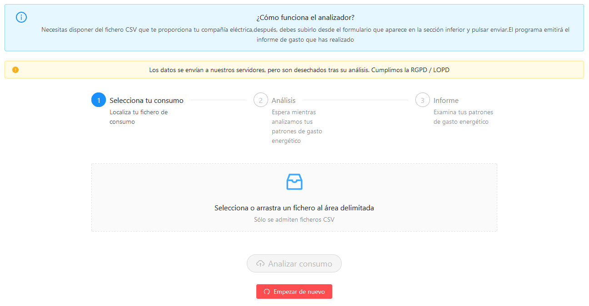
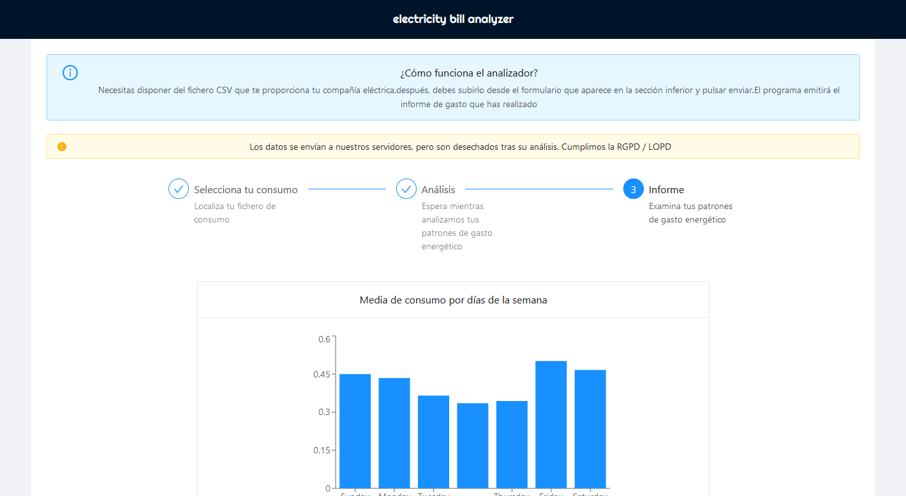

# Electricity bill Analyzer

This reposiory contains the code for the Golang Cloud Functions/Lambdas used to parse and analyze your real consumptions provided by your electricity distribution company and gives you practical information about hourly and daily usage.

It also contains the React web-app already published with Github Pages for public usage: [https://mtenrero.github.io/electricity-bill-analyzer/](https://mtenrero.github.io/electricity-bill-analyzer/)

This will help you in making clever decissions about your electricity provider promotions and product selection.

## How it works?

You need to provide a CSV file from your electricity provider [Iberdrola Distribución](https://www.iberdroladistribucionelectrica.com/consumidores/inicio.html) to the published web app [https://mtenrero.github.io/electricity-bill-analyzer/](https://mtenrero.github.io/electricity-bill-analyzer/).

Then a report summary will appear on your screen:

## The report I'm providing it's not compatible

Feel free to open an issue and I investigate the cause and I'll try to add your consumption schema to the analyzer. Please provide full information: country, and electricity brand distributor name.

## Technical data

The backend is written in pure Go and the frontend is made with React and Recharts lib.

### parser

For now, it's only compatible with Spanish Iberdrola (i-DE) electricity provider, which allows the contract owner download a CSV file with the summary of the power consumed.

The package has a byte array as argument with the content of the previously mentioned CSV file.

You can grab this file registering yourself into your electricity provider like: [Iberdrola Distribución](https://www.iberdroladistribucionelectrica.com/consumidores/inicio.html)

### cloud-functions

The backend is intended to be run in a serverless deployment, this package contains the cloud functions.